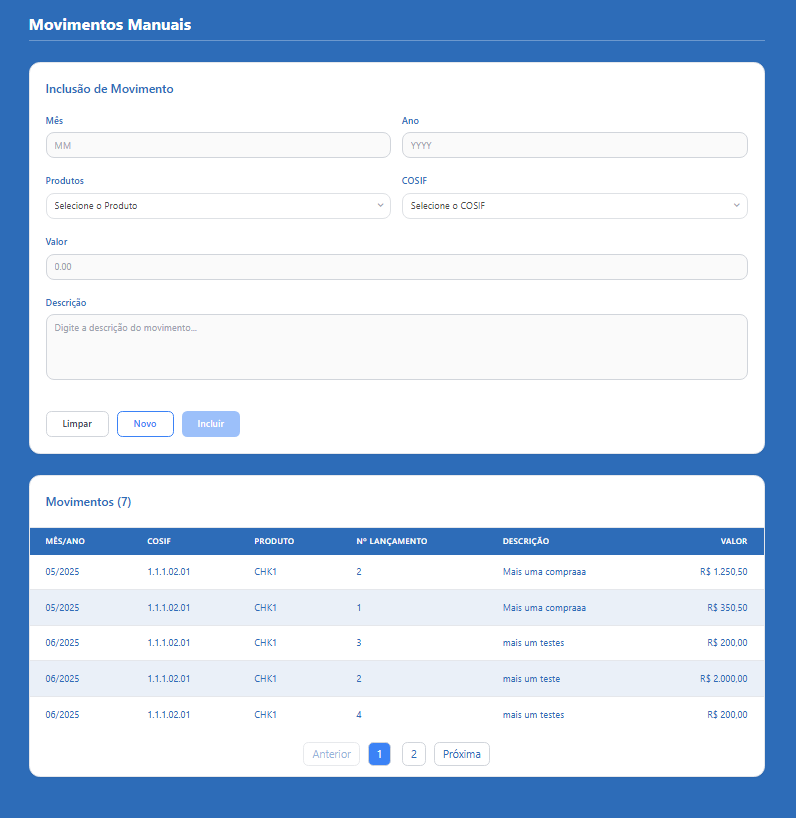

# Desafio para vaga Dev .NET / Angular

Bem-vindo ao desafio técnico para a vaga de desenvolvedor(a) .NET/Angular! Este projeto consiste em um sistema completo para **gerenciamento de movimentos manuais** em um contexto financeiro, com back-end em .NET 9 (Clean Architecture, CQRS, DDD) e front-end em Angular 18 + Tailwind CSS.

---

## 📸 Exemplo de Tela

Veja abaixo um exemplo da interface principal do sistema:



---

## 🏗️ Visão Geral do Sistema

O sistema permite:

- Inclusão, listagem e paginação de movimentos manuais
- Cadastro e consulta de produtos e COSIFs
- Validação de regras de negócio financeiras
- Interface moderna, responsiva e amigável

**Tecnologias principais:**

- Back-end: .NET 9, Entity Framework Core, MediatR, FluentValidation, AutoMapper
- Front-end: Angular 18, TypeScript, Tailwind CSS
- Banco de dados: SQL Server

---

## 📁 Estrutura do Projeto

```bash
Antlia/
├── back/ManualMovementsManager/ManualMovementsManager/src/...
│   └── ... (API, Application, Domain, Infrastructure, CrossCutting)
├── front/manual-movements/src/...
│   └── ... (Angular app)
├── scripts/
│   └── InsertInitialData.sql, InsertProductCosifs.sql, InsertProducts.sql
├── docs/
│   └── page.png, swagger.json, escopo.md, modelo.html
└── README.md (este arquivo)
```

---

## 🚀 Como Executar o Projeto

### 1. Pré-requisitos

- [.NET 9 SDK](https://dotnet.microsoft.com/download/dotnet/9.0)
- [Node.js 18+](https://nodejs.org/)
- [SQL Server](https://www.microsoft.com/sql-server)
- [Angular CLI 18](https://angular.io/cli)

### 2. Back-end (.NET)

1. Acesse a pasta do back-end:

   ```bash
   cd back/ManualMovementsManager/ManualMovementsManager
   ```

2. Configure a connection string em `src/ManualMovementsManager.Api/appsettings.json`.
3. Execute as migrações para criar o banco:

   ```bash
   dotnet ef database update --project src/ManualMovementsManager.Infrastructure --startup-project src/ManualMovementsManager.Api
   ```

4. Popule o banco com dados de exemplo (veja seção Scripts).
5. Rode a API:

   ```bash
   dotnet run --project src/ManualMovementsManager.Api
   ```

6. Acesse a documentação:

   - Swagger: <https://localhost:7094/swagger>
   - Health: <https://localhost:7094/health>

### 3. Front-end (Angular)

1. Acesse a pasta do front-end:

   ```bash
   cd front/manual-movements
   ```

2. Instale as dependências:

   ```bash
   npm install
   ```

3. Rode o servidor de desenvolvimento:

   ```bash
   ng serve
   ```

4. Acesse em: <http://localhost:4200/>

---

## 🗄️ Scripts de Banco de Dados

Para popular o banco com dados de exemplo:

1. Execute as migrações normalmente.
2. Abra o arquivo `scripts/InsertInitialData.sql` no SQL Server Management Studio.
3. Execute o script para inserir produtos e COSIFs.

Verifique os dados com:

```sql
SELECT * FROM PRODUTO;
SELECT * FROM PRODUTO_COSIF;
```

---

## 🔗 Endpoints Principais da API

- **Movimentos Manuais:**
  - `GET /api/v1/manualmovement` — Lista movimentos (com paginação)
  - `POST /api/v1/manualmovement` — Cria novo movimento
- **Produtos:**
  - `GET /api/v1/product` — Lista produtos
  - `POST /api/v1/product` — Cria novo produto
- **COSIF:**
  - `GET /api/v1/productcosif` — Lista COSIFs
  - `POST /api/v1/productcosif` — Cria novo COSIF

Veja mais detalhes e exemplos no Swagger da API.

---

## 📝 Exemplos de Uso (cURL)

Criar movimento manual:

```bash
curl -X POST "https://localhost:7094/api/v1/manualmovement" \
  -H "Content-Type: application/json" \
  -d '{
    "month": 6,
    "year": 2025,
    "launchNumber": 1,
    "productCode": "CHK1",
    "cosifCode": "1.1.1.02.01",
    "description": "Mais uma compra",
    "movementDate": "2025-06-01T10:00:00Z",
    "userCode": "USER001",
    "value": 1250.50
  }'
```

---

## 👩‍💻 Arquitetura e Boas Práticas

- Clean Architecture, CQRS, DDD, SOLID
- Validações robustas (FluentValidation)
- Logging estruturado e health checks
- Front-end modular, responsivo e acessível
- Testes unitários para back e front

---

## 🙏 Créditos e Referências

- Projeto baseado no template oficial [Biss Solutions MicroService .NET 9](https://www.nuget.org/packages/Biss.Solutions.MicroService.Template.Net9/2.0.0)
- Front-end inspirado no design do arquivo `docs/modelo.html`
- Desenvolvido para o desafio Antlia / BNP

---

**Desenvolvido por Ivana**
